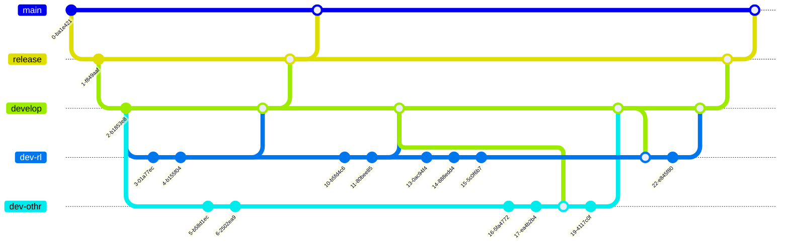

# SSMRipley.FOCUS
Este repositorio contiene la fuente de la plataforma SSMRIPLEY.

## Importante :wink:

Flujo de trabajo con git.



## Uso de las ramas

| Rama | Tipo Rama | Allow Merge | Descripción |
| - | - | - | - |
| **main** | Producción | **release** | `Merge permitido` si después de finalizar el seguimiento no hay incidencias en la rama **release**. |
| **release** | Producción | **develop** | `Merge permitido` si QA y CQA aprueban el desarrollo sobre la rama **develop**. |
| **develop** | Desarrollo | **dev-*** | `Merge permitido` por cualquier rama **dev**, solo si desarrollador terminó el requerimiento. |
| **dev-rl** | Desarrollo | - | Rama desarrollador con sus cambios. |
| **dev-othr** | Desarrollo | - | Rama de otro desarrollador. |

## Nomenclatura ramas

> **`dev-rl`**-*`carga`-`tlmk`*
>
> **`dev-othr`**-*`venta`-`online`*
>
> **`dev-othr`**-*`venta`-`pre-emision`*

Modificación dependiendo del autor y módulo a cambiar (*Opcional*)

# Consideraciones :cry:

- Es posible crear nuevas ramas a partir de main o release, solo si es un cambio de emergencia.
- Cada modificación en algún módulo debe tener su propio README con una descripción del ajuste realizado con el # de línea y/o función modificada.

Syntax change in javaScript file

``` js
var foo = function (bar) {
  return bar++;
};

console.log(foo(5));
```
